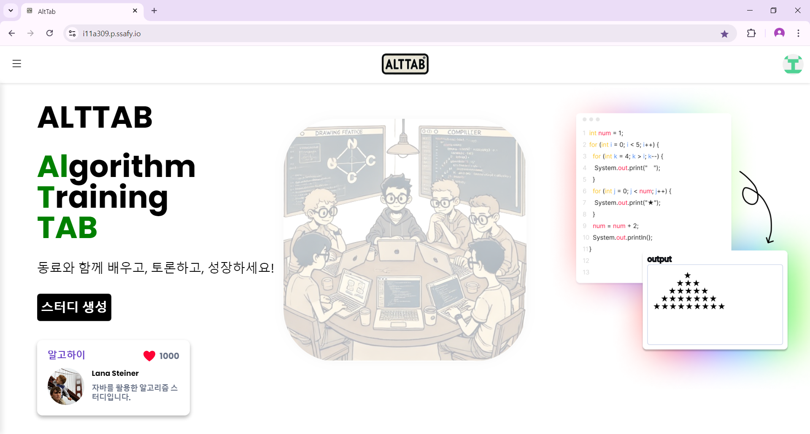
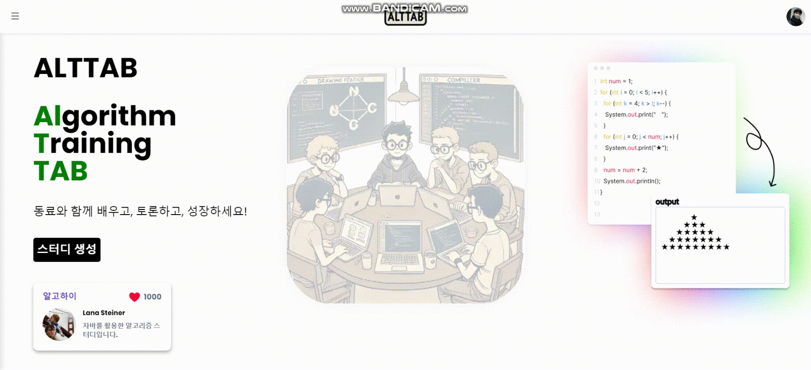
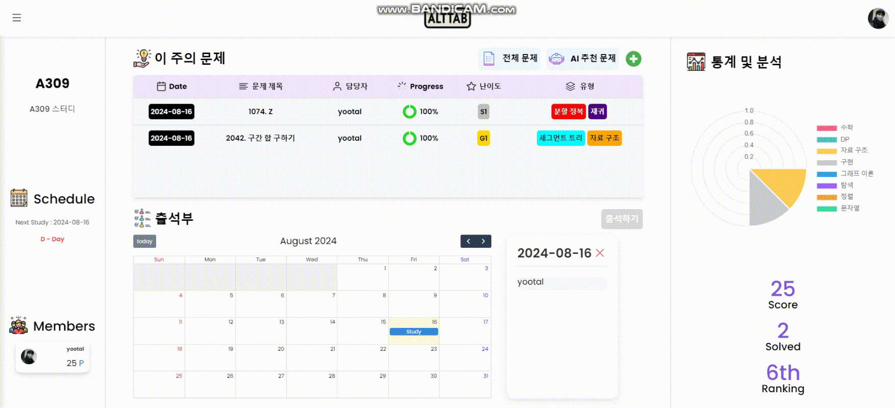
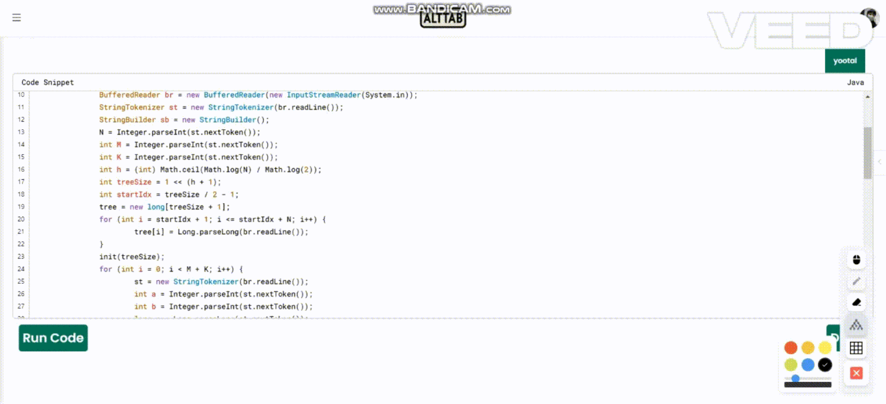
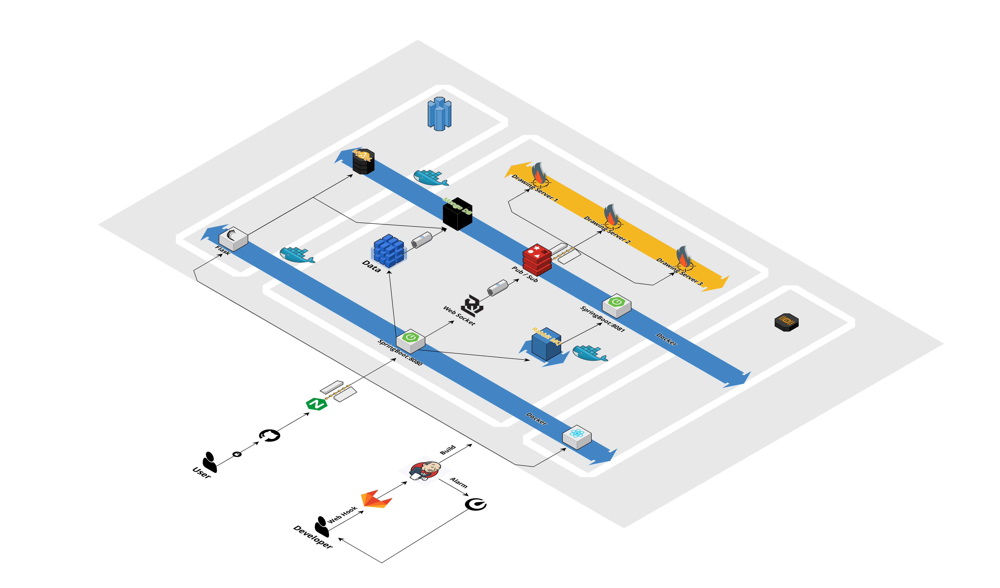
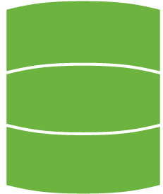
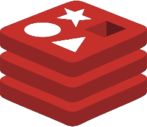

### ✨ 한 곳에서 해결하는 알고리즘 스터디! AltTab 📖

## 💬 서비스 소개

###   알고리즘 트레이닝의 새로운 차원

알고리즘 학습, 이제는 AltTab으로 전환하세요! Algorithm Training Tab의 약자인 AltTab은 여러분의 코딩 실력을 한 단계 끌어올릴 준비가 되어 있습니다.

### 🔄 AltTab: 학습 모드로의 빠른 전환

키보드의 Alt+Tab처럼, AltTab은 여러분을 순식간에 효율적인 알고리즘 학습 환경으로 안내합니다.

### 🖌️ 실시간 아이디어 시각화

복잡한 알고리즘도 두렵지 않아요. 실시간 드로잉 기능으로 여러분의 아이디어를 즉시 도식화하고 팀원들과 공유하세요.

### ⚡ 즉각적인 코드 실행

내장 컴파일러로 이론에서 실전으로 빠르게 전환하세요. 생각한 알고리즘을 바로 테스트하고 결과를 확인할 수 있습니다.

### 📘 블록 스타일 에디터로 직관적인 풀이 관리

블록 스타일의 에디터를 통해 여러분의 알고리즘 풀이를 더욱 구조적이고 직관적으로 관리하세요. 마치 레고 블록을 조립하듯 여러분의 아이디어를 체계적으로 구성할 수 있습니다.

### 🧩 백준 문제로 실력 향상

AltTab은 유명한 알고리즘 문제 사이트인 백준과 연계하여 다양한 난이도의 문제를 제공합니다. 백준의 풍부한 문제 세트를 AltTab의 강력한 학습 도구와 함께 활용해보세요.

### 👀 다른 스터디 그룹에서 영감 얻기

다른 스터디 그룹들의 학습 현황을 살펴보며 영감을 얻으세요. 직접적인 소통은 없지만, 다른 그룹들의 진행 상황을 보며 동기 부여를 받고 새로운 학습 방식을 발견할 수 있습니다.

AltTab과 함께라면, 여러분의 알고리즘 실력은 새로운 차원으로 도약할 것입니다. 지금 바로 AltTab을 눌러 알고리즘의 세계로 뛰어들어보세요!

**AltTab: 알고리즘 트레이닝, 이제 탭 하나로 시작하세요**

## ⚙️ 주요 기능

<table>
	<tr >
		<td align="center">
		<strong>랜딩 페이지</strong>
		</td>
	</tr>
	<tr>
		<td align="center">
			
		</td>
	</tr>
</table>

| <b>스터디 생성</b> | <b>문제 추천</b> |
|:--:|:--:|
|  |  |
| <b>컴파일러 정답</b> | <b>Draw</b> |
|  |  |
| <b>컴파일러 에러</b> | <b>풀이 페이지</b> |
|  |  |

## 🖋 Service Architecture

	

## ⛓ Tech Stack

 

    <table border=""4>
        <th style="text-align: center;">Role</th>
        <th style="text-align: center;" colspan="2">Framework</th>
        <!-- FrontEnd Stack -->
        <tr>
            <td rowspan="5" align="center"><b>FE</td>
            <td>&nbsp;&nbsp;<b>HTML</td>
            <td rowspan="3" style="vertical-align: middle;">Website Building Components</td>
        </tr>
        <tr>
            <td>&nbsp;&nbsp;<b>CSS</td>
        </tr>
        <tr>
            <td>&nbsp;&nbsp;<b>JavaScript</b></td>
        </tr>
        <tr>
            <td>&nbsp;&nbsp;<b>React</b></td>
            <td>Frontend Framework</tdi>
        </tr>
        <tr>
            <td>&nbsp;&nbsp;<b>TypeScript</b></td>
            <td>Frontend Programming Language</tdi>
        </tr>
        <!-- Backend Stack -->
        <tr>
            <td rowspan="6" align="center"><b>BE</td>
            <td>&nbsp;&nbsp;<b>Java21-Spring</td>
            <td rowspan="2">Spring Server Framework</td>
        </tr>
        <tr>
            <td>&nbsp;&nbsp;<b>Spring Boot</td>
            <tr>
            <td>&nbsp;&nbsp;<b>JPA & Data JPA</td>
            <td rowspan=1>Data Processing Skills</td>
        </tr>
        <tr>
            <td>&nbsp;&nbsp;<b>MySQL 8.0</td>
            <td>Back-End Main Database</td>
        </tr>     
        <tr>
            <td>&nbsp;&nbsp;<b>Mongo DB</td>
            <td>Back-End Main Database</td>
        </tr>   
        <tr>
            <td>&nbsp;&nbsp;<b>Redis</td>
            <td>Back-End Main Database</td>
        </tr>   
        <!-- Tools --> 
        <tr>
            <td rowspan="4" align="center"><b>Tools</td>
            <td>&nbsp;&nbsp;<b>Git</td>
            <td>Version Control System (VCS)</td>
        </tr>
        <tr>
            <td>&nbsp;&nbsp;<b>Notion</td>
            <td>Collaborative Productivity Platform</td>
        </tr>
        <tr>
            <td>&nbsp;&nbsp;<b>Google Slides</td>
            <td rowspan="2">Google Workspace Productivity Tools</td>
            <tr>
            <td>&nbsp;&nbsp;<b>Google Sheets</td>
        </tr>
    </table>

## 👥 Developers

 

    <table border=""6 width="50%">
        <tr>
            <th style="text-align: center;" colspan="2">FrontEnd</th>
            <th style="text-align: center;" colspan="3">Backend</th>
            <th style="text-align: center;" colspan="1">Infra</th>
        </tr>
        <tr>
            <td align="center"><a href="https://github.com/LEEJW1953"></td>
            <td align="center"><a href="https://github.com/Jaeyoung9999"></td>
            <td align="center"><a href="https://github.com/noxknow"></td>
            <td align="center"><a href="https://github.com/jijongkwon"></td>
            <td align="center"><a href="https://github.com/yootal"></td>
            <td align="center"><a href="https://github.com/ssh2957"></td>
        </tr>
        <tr>
            <td align="center"><a href="https://github.com/LEEJW1953">이지원</td>
            <td align="center"><a href="https://github.com/Jaeyoung9999">이재영</td>
            <td align="center"><a href="https://github.com/noxknow">이치왕</td>
            <td align="center"><a href="https://github.com/jijongkwon">지종권</td>
            <td align="center"><a href="https://github.com/yootal">유경헌</td>
            <td align="center"><a href="https://github.com/ssh2957">신승호</td>
        </tr>
    </table>

